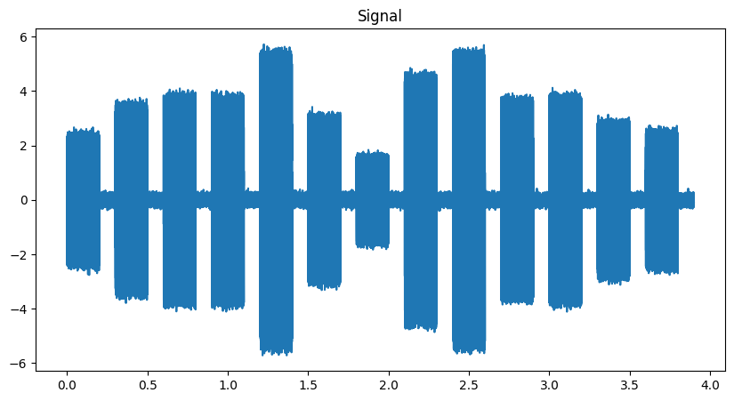
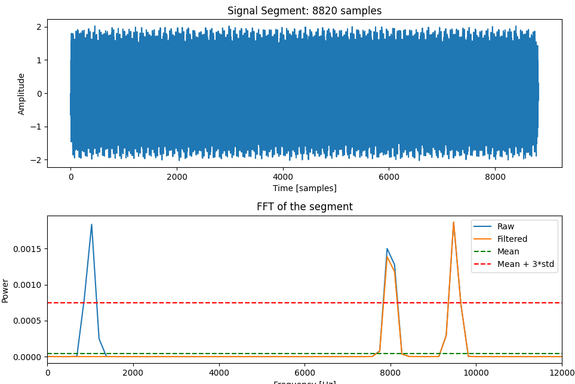
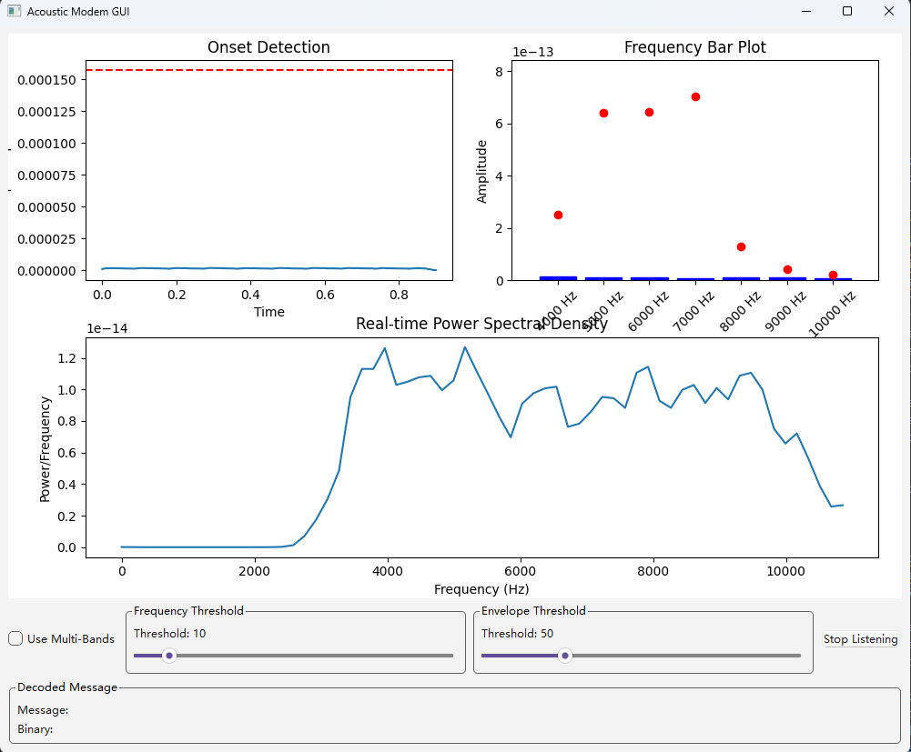

# Acoustic Modem Project

This is the Paradromic internship qualification project. In this project, I will design and implement an acoustic modem system that can encode text into a sequence of tones and decode the sequence back to text.  

This project uses frequency encoding and the ASCII system to encode text into acoustic signals and then decode the signals in real-time.  

## Before we start
This project doesn't work in the real world when I tested it on my local computer. If the encoded signal is directly passed to the decoder, it will decode perfectly, which can be verified by running `python protocol.py`. However, in the real world, when I play it using my speaker and microphone, the frequency domain becomes a mess. I tried many ways but still couldn't fix it. It might also be related to my poor speaker and microphone from a 2018 second-hand ThinkPad.

Anyway, I tried my best to make this work in these two weeks and want to submit it before it's too late. I got this project on March 25th while I was traveling and didn't have my laptop, so I could only start testing it after I got back last week. **Another thing I want to mention is that the GUI in this project was created with the help of an AI coding tool because I'm not familiar with GUI coding using Python. I want to make this clear because I don't know if this is allowed.**

Please contact me if you have more questions. I know there are going to be bugs and I will be glad to take this as an initial submission and keep work on this.

## Environment
- Python 3.12
- Required Python libraries:  
   - `numpy`
   - `scipy`
   - `matplotlib`
   - `pyaudio`
   - `PyQt6` (for GUI)

## Methods
The project uses the following methods:  

- **Encoding**: Text messages are encoded into acoustic signals using frequency modulation. Each character is first transformed into a 7-digit binary number based on the ASCII system, then each digit is assigned to a frequency. A frequency domain signal is then created based on the binary number and transferred to the time domain. The length of the time domain signal is a hyperparameter that can be tuned.  
After encoding the frequency domain information indicating the binary number, another fixed frequency (base frequency) sine wave is added to each segment of the signal for further real-time onset detection.  
An encoded sentence in the time domain will look like:  
  
And one segment in this signal will look like:  

- **Decoding**: Acoustic signals are decoded back into text using envelope detection and frequency analysis. I've implemented various listeners, which are described in detail below. At the core of the listener is the *char_decoder* function in the protocol. This function processes signal segments by filtering them, identifying the frequency domain values near the target frequencies that represent binary digits, and comparing these values with a reference. If the frequency value exceeds the reference, the function outputs the corresponding binary digit and character.

- **Real-Time Processing**: The system supports real-time encoding and decoding using PyAudio for audio input/output. In `sender.py`, every time the user inputs a message in the terminal, the program calls the *test_encoder* function in the protocol, and PyAudio plays it. In `listener.py`, the *RealTimeListener* records the environment in real-time. Every time it detects the acoustic signal onset by examining the base frequency envelope, the buffer is recorded, and after the offset, the segment is sent to decode. These functions together enable real-time processing.

- **Visualization**: Visualization is provided in different ways in different listeners. In *Listener* and *ContinuousListener*, the envelope plot, reference plot, PSD plot, and target frequency bar plot pop up after the sentence is finished or the program is terminated.

## Structure

The main structure of this project:

`protocol.py`: Includes the main parameters such as sampling frequency, base frequency, segment length, and target frequency list, as well as basic functions like *test_encoder*, *char_decoder*, and so on. Some important functions are listed below:
- *text_encoder*: It first converts the text to integers using ASCII, and then converts each integer to a 7-digit binary number. Each 0 and 1 in the binary number sets a value in a frequency domain signal, and the frequency domain value is converted to a time domain signal segment using the *rfft* function. A base frequency is also added to the segment, and this process is applied to each character in the text. After creating the signal, another silence base frequency is added to the entire signal for the listener to divide the sentences.
- *text_decoder*: It takes in the signal and first calculates the mean and standard deviation for each target frequency on the entire signal using a windowed Fourier transform and sets a reference. Then it performs another function called *onset_detection_offline*, where the signal is filtered to the base frequency and enveloped using Hilbert transformation and median value filtering to perform onset detection. After onset detection, the raw signal is divided into segments that represent different characters and sent to the *char_decoder*. The text decoder finally gathers the output from the char decoder to form a sentence.
- *char_decoder*: The char decoder takes in the signal segments that represent different characters and filters them to the target frequency. After filtering, it calculates the PSD of the signal. If the value around the target frequency is higher than the reference, the binary value at that digit is set to one. After getting the binary value, the decoder converts it back to a character.

`sender.py`: The sender function takes in the text input from the terminal and plays the encoded acoustic signal using PyAudio.  

`listener.py`: The basic classes of listeners include:
- *Listener*: The most basic listener class, runs in the terminal, and should be stopped after a sentence is played by pressing `ctrl+c`. It will automatically run the decoder and plot the data.
- *ContinuousListener*: A listener that runs continuously and detects the *BASE_FREQUENCY_SILENCE* to divide the sentence. It uses the *text_decoder* to decode the sentence and print it.
- *RealTimeListener*: The real-time listener uses the base frequency to detect each character and can decode the characters in real-time. It also plots the PSD, envelope, and target frequency power in real-time. When it starts to listen, the real-time listener needs to record one-second data as the reference.

`gui_listener.py`: Provides a GUI that plots PSD, envelope, and target frequency power in real-time. It also provides two slide bars where you can change the threshold of envelope onset detection and frequency reference. **A large portion of the GUI was created with an AI coding tool because I'm not familiar with Python GUI coding. I'm pointing this out because I don't know if it's allowed, so I want to make it clear.** The GUI looks like the image below:  

`util.py`: Contains functions that might be helpful for debugging and code cleanliness, such as calculating and plotting PSD and FFT, enveloping the signal, and so on.

## How To Run
The easiest way:  
In two separate terminals, run `python sender.py` and `python gui_listener.py`. Click the *Start Listening* button in the GUI and input the text in the sender terminal.

## Trade off
The main trade off between the speed and accuracy lays in the segment legth of each character. The default value of segment length is 0.2 seconds and there's a 0.1 seconds idle period between each segment. If the segment length is too short, both the envelope and frequency detection may fail. As we learn from the Fourier transform, the frequency domain resolution is $1/T$, where $T$ is the segment legth. So there's a trade off between the frequency resolution and communication speed.